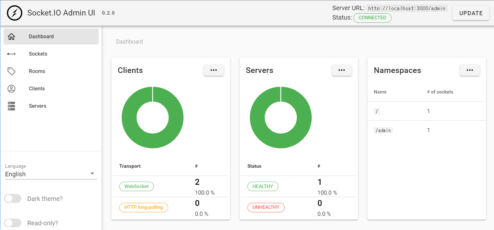

# Zoom_CLone

> socket.io와 Websockets을 공부 하기 위한 레파지토리입니다!

## nodeJs

> websocket 서버 셋팅 

```
    const server = http.createServer(app);
    //http 서버

    const wss = new WebSocket.Server({server});
    //websocket 서버
```
<br />

> websocket이 연결이 돼있는 경우 콜백 함수를 불러 실행 시킨다 
    addEventListener와 매우 흡사한 형식

<br />

> 콜백 함수는 socket을 파라미터로 받는다

ex
```
    wss.on( "connection", CB(socket) )
```

<br />

> 파라미터로 받는 socket으로 메시지들을 서로 주고 받을 수 있다

```
    wss.on("connection", (socket) => {

        socket.on("close", () => {
            console.log("disconnected from the Browser")
        }); //프론트가 websocket을 종료 했을 때

        socket.on("message", (msg) => {

            const message = JSON.parse(msg.toString('utf8'));
            //단순히 텍스트 뿐 아니라,  
            //JSON의 형태로 더 많은 데이터를 주고 받는다

            socket.send(message.toString('utf8'));
            //프론트단으로 메세지를 보낸다. 
        }) 

    })
```

<br />

## JavaScript 

<br />

> websocket은 js에서 내장되어있는 api 이다.

```
    const socket = new WebSocket(`ws://${window.location.host}`); 
```

<br />

> 서버에서 어떠한 응답을 받았을 때, addEventListener로 받는다. 

```
    socket.addEventListener("message", (message) => {

        const li = document.createElement("li");
        li.innerText = message.data;
        messageList.append(li);
        //받은 메세지를 li태그에 넣어서 ul태그에 append 시킨다. 
    });
```

<br />

> 서버로 보낼때 또한 마찬가지이다.

```
    messageForm.addEventListener("submit", (e) => {
        e.preventDefault();
        const input = messageForm.querySelector("input");

        socket.send(makeMessage("new_message", input.value));
        //메세지 보내기 

        const li = document.createElement("li");
        li.innerText = `You: ${input.value}`;
        messageList.append(li);
        input.value = "";
    });
```

<br />
---
<br />

# socket.io

> websocket의 부가기능이 아닌 리얼타임을 위한 프레임 워크. 

> 프론트단과 서버단에서 서로 emit으로 이벤트를 만들고, on으로 이벤트를 받는다

<br />

app.js
```
    socket.emit("new_message", value, roomname, () => {
        addMessage(`You: ${value}`);
    });
```

<br />

server.js
```
    socket.on("new_message", (msg, room, callback) => {
        socket.to(room).emit("new_message", `${socket.nickname}: ${msg}`);  //방 전체 알림
        callback();
    })
```

<br />

## nodeJS

<br />

> websocket과 마찬가지로 서버를 만들어 준다 

```
    const wsServer = new Server(server);
```

<br />

>  연결은 websocket과 아주 흡사하다 

```
    wsServer.on("connection", socket => {
        socket.onAny((e) => {
            console.log(`socket event : ${e}`);
        });

        socket.on("enter_room", (roomname, done) => {            
            socket.join(roomname)
            done();
            socket.to(roomname).emit("welcome");
        })
    })
```

<br />

> adapter => 다른 서버에 있는 유저끼리는 정보를 주고 받을 수 있게 adapter가 도와준다.

```
    function publicRooms(){
        const { sockets: {adapter: { sids, rooms } } } = wsServer

        const publicRooms = [];
        rooms.forEach( (_, key) => {
            if(sids.get(key) === undefined) { //privite room을 찾아줌
                publicRooms.push(key);
            }
        })
        return publicRooms;
    }
```

<br />

> size => room에 접속한 유저의 수를 알 수 있다.

```
    function countRoom(roomName){
        return wsServer.sockets.adapter.rooms.get(roomName)?.size;
    }
```

<br />

> room 생성 => socket의 join 함수로 쉽게 생성 할 수 있다.

```
     socket.join("room 의 이름");
```

<br />

> disconnecting과 disconnect의 차이

```
    disconnecting => 방을 나가기 직전 / disconnect 방을 나간 후 
```

<br />

## JavaScript

> websocket과 흡사한 방식으로 서버와 연결한다

```
    form.addEventListener("submit", (e) => {
        e.preventDefault();
        const input = form.querySelector("input");
        socket.emit("enter_room", input.value, showRoom);
    });
```

<br />

---

<br />

## admin

<br />

> socket에서 채팅방과 유저의 데이터들을 볼 수 있는 어드민 페이지를 제공해준다. 

> 기본 셋팅

server.js
```
    const wsServer = new Server(server, {
        cors: {
            origin: ["https://admin.socket.io"],
            credentials: true
        }
    });
```

<br />

server.js 
```
    instrument(wsServer, {
        auth: false
    })
    //어드민 페이지 로그인을 위한 설정 => false 해준 이유는 별 다른 로그인 없이 볼 수 있게 설정
```

<br />

> https://admin.socket.io 여기에 접속하면 admin 페이지 볼 수 있다. 


<br />

## getCamera 
> 브라우정에 카메라를 키는건 어렵지 않다. 서버는 기본 설정만 해주고 대부분이 js에서 작업

<br />
<br />

> 어떤 카메라가 있는지 파악하는 함수

```
    async function getCameras(){
        try{
            const devices = await navigator.mediaDevices.enumerateDevices();
            //유저가 가지고 있는 모든 메디아 정보
            
            const cameras = devices.filter(device => device.kind === "videoinput");
            //디바이스 중에서 카메라 정보만 가져오기

            const currentCamera = myStream.getVideoTracks()[0];
            //현재 켜져있는 카메라

            cameras.forEach(camera => {
                const option = document.createElement("option");
                option.value = camera.deviceId;
                option.innerText = camera.label;
                if(currentCamera.label == camera.label){
                    option.selected = true;
                    //현재 선택된 카메라가 셀렉트 박스 젤 위에 보이게
                }
                camerasSelect.appendChild(option);
            })

        }catch(e){
            console.log(e)
        }
    }
```
<br />
<br />

> 카메라 정보를 가져와서 선택하는 함수
```
    async function getMedia(deviceId){
        const initioalConstrains = {
            audio: true,
            video: { facingMode: "user"},  //브라우저든 모바일이든 무조건 셀카 카메라로 작동
        }
        const cameraConstraints = {
            audio: true,
            video: {
                deviedId: {exact: deviceId }  //exact 없이 적어주면 해당 아이디값의 카메라가 없을떄, 비디오가 실행 안된다. 
                //근데 위와 같이 적으면 카메라 찾다가 못찾으면 다른 카메라 실행
            }
        }
        try{
            myStream = await navigator.mediaDevices.getUserMedia(
                deviceId ? cameraConstraints : initioalConstrains
            )        
            // myStream 이라는 변수에 현재 가지고 있는 미디어 장치에 접근하는 방식
            // 가지고 오고싶은 정보를 객체 형식으로 파라미터로 넣어준다
            myFace.srcObject = myStream;
            if(!deviceId){
                await getCameras();
                //젤 처음만 실행하면됨. 카메라 변경할때마다 실행되면 selectbox 길어짐
            }
        } catch(e){
            console.log(e);
        }
    }
```

<br />
<br />

> 당연히 카메라는 키고 끌 수 있다.
```
    function handlecameraClick(){
        myStream.getVideoTracks().forEach(track =>  track.enabled = !track.enabled);
        if(!cameraOff){
            camera.innerText = "Turn Camera Off";
            cameraOff = true;
        }else{
            cameraOff = false;
            camera.innerText = "Turn Camera On";
        }
    }
```

## WebRTC 

> 별도의 플러그인 없이 브라웆간 비디오, 음성 데이터등을 p2p로 통실 할 수있게 해주는 표준

```
    let myPeerConnection = new RTCPeerConnection();
```

<br />

> 개발단계에서는 구글에서 제공해주는 무료 stun 서버를 활용한다. 전문적인 프로젝트라면 stun 서버를 제작해야 한다.

```
    let myPeerConnection = new RTCPeerConnection({
        iceServers: [
            {
                urls: [
                    "stun:stun.l.google.com:19302",
                    "stun:stun1.l.google.com:19302",
                    "stun:stun2.l.google.com:19302",
                    "stun:stun3.l.google.com:19302",
                    "stun:stun4.l.google.com:19302",
                ]
            }
        ]
    });
```

<br />

> 아래 사진을 보며 단계 대로 서버와 필요한 정보를 주고 받으면서 
상대의 미디어 정보, ip 정보등을 받아서 연결 시킨다. 


<br />

## Data channel

> 서로 원하는 모든 것을 주고 받을 수 잇게 해준다. socket.io없이 채팅도 가능
 서로 파일 전송도 가능